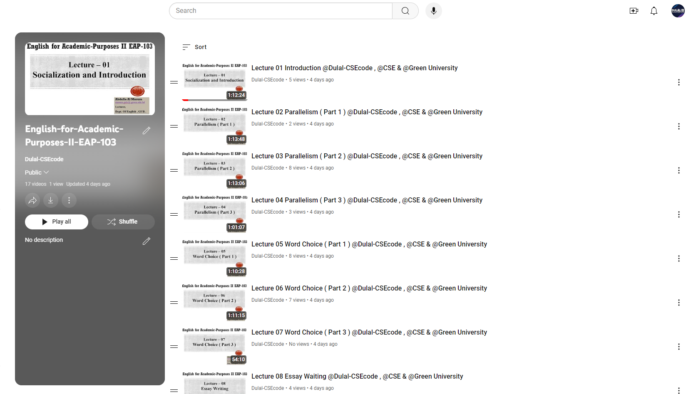

<h1 align="center">--- English-for-Academic-Purposes-II-EAP-103 ---</h1>  
<h3 align="center">-- Spring 2022 --</h3>  
<br />  
Welcome to the English for Academic Purposes II (EAP-103) repository. This repository contains course materials, assignments, and resources designed to improve your academic English skills.  
<br />  
Check out the playlist now and start your learning journey: [English for Academic Purposes II YouTube Playlist Link : ](https://youtube.com/playlist?list=PLEc-WcPXUsjue9VQAomiGG3S8LoYEloqt&si=36IqstfexcjOwT75)
**Happy Learning!**
<br />



  
<br />  

## Table of Contents
- [Introduction](#introduction)
- [Course Outline](#course-outline)
- [Installation](#installation)
- [Prerequisites](#prerequisites)
- [Assignments and Practice Problems](#assignments-and-practice-problems)
- [Usage](#usage)
- [Contributing](#contributing)
- [License](#license)

## Introduction

In this course, we will focus on advancing your academic English skills, covering topics such as parallel structure, essay writing, reading comprehension, listening practice, word choice, and more. This repository provides all the necessary materials to help you succeed in this course.

## Course Outline

### Day 1: Introduction to Course & Socialization

### Day 2: 
- Parallel Structure: Discussion and Practice 1
- Assign Homework

### Day 3: 
- Review and Homework Checking
- Parallel Structure Discussion and Practice 2
- Assign Homework

### Day 4: 
- Review and Homework Checking
- Writing Discussion and Practice: Compare and Contrast Essay 1
- Assign Class Test

### Day 5: 
- Class Test 1 on Parallel Structure
- Review on Reading Practice: Answering Questions
- Writing Discussion and Practice: Compare and Contrast Essay 2

### Day 6: 
- Word Choice: Discussion & Practice 1
- Listening Practice
- Class Test 1 Script Showing

### Day 7: 
- Word Choice: Discussion & Practice 2
- Assign Homework

### Day 8: 
- Word Choice: Discussion & Practice 3
- Assign Homework and Class Test

### Day 9: 
- CT 2 on Word Choice
- Reading Practice - 1

### Day 10: 
- Listening Test
- Class Test 2 Script Showing

### Day 11: 
- Reading Practice - 2

### Day 12: 
- Review & Question Pattern

### Mid-Term

### Day 13: 
- Speaking Practice
- Script Showing

### Day 14: 
- Fragments: Discussion and Practice 1
- Speaking Practice

### Day 15: 
- Fragments: Discussion and Practice 2
- Assign Class Test 3

### Day 16: 
- Reading Practice
- Presentation Guidelines -1

### Day 17: 
- Modifiers: Discussion and Practice 1
- Presentation Guidelines - 2

### Day 18: 
- Class Test 3 on Fragments
- Modifiers: Discussion and Practice 2
- Assign Homework

### Day 19: 
- Modifiers: Discussion and Practice 3
- Writing Discussion: News Article Writing 1

### Day 20: 
- Writing Discussion: News Article Writing 1
- Speaking Practice

### Day 21: 
- Presentation

### Day 22: 
- Presentation

### Day 23: 
- Speaking Test

### Day 24: 
- Review and Question Pattern

## Installation

To set up the environment:

1. Clone the repository:
   ```bash
   git clone https://github.com/Dulal-CSEcode/English-for-Academic-Purposes-II-EAP-103.git
   cd English-for-Academic-Purposes-II-EAP-103


2. Install any required packages or dependencies. For example, on a Debian-based system:

    ```bash
    sudo apt-get update
    sudo apt-get install build-essential
    ```

## Prerequisites

Before you begin, ensure you have met the following requirements:

- You have a basic understanding of programming concepts.
- You have access to a Java compiler.
- You have a basic understanding of Object-Oriented Programming.
- You have Git installed on your computer.

## Assignments and Practice Problems

This repository includes a collection of assignments and practice problems to help reinforce the concepts taught in the course. Each assignment is located in its respective directory with detailed instructions and resources.

## Usage
Navigate to the specific assignment or practice problem directory and follow the instructions provided in the README.md file located in each folder.

## Contributing
Contributions are welcome! To contribute, please follow these steps:

1. Fork the repository.

2. Create a new branch (e.g., feature-branch).

3. Make your changes and commit them (git commit -m 'Add new feature').

4. Push to the branch (git push origin feature-branch).

5. Create a pull request.

Please ensure your code follows the repository's coding standards and includes appropriate tests.

## License
This project is licensed under the MIT License. See the LICENSE file for more details.


<br/>
<h2 align="center"> Thanks for visiting the English-for-Academic-Purposes-II-EAP-103 repository.</h2>
<h3 align="center">© All rights reserved by Dulal-CSEcode @2024 © Department of Computer Science and Engineering, GUB </h3>
